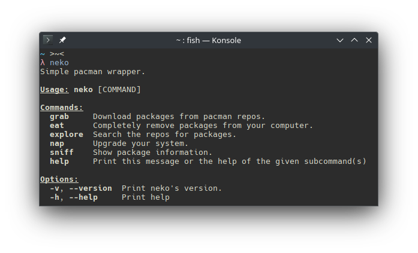

<h1 align="center">Neko</h1>
<p align="center" markdown="1">
    The easy to use pacman wrapper.
    
</p>

<h2 align="center">Installation</h2>

### Using the relases page (Recommended)
Navigate to the [releases page](https://github.com/its-Lyn/neko/releases).
Once there, you can click the latest release and download it. <br>

Now, extract it using your favourite file manager and run `setup.sh`. This will put the binary in `/usr/local/bin` and will be runnable from anywhere in your system!

### Compiling yourself (Advanced)
#### Prerequisities
Neko is a really small rust application. To install neko you will need both git and rust installed.
```bash
# Run the following commands in your favourite terminal
## This will install rust 
curl --proto '=https' --tlsv1.2 -sSf https://sh.rustup.rs | sh
## This will install git
sudo pacman -S git
```
#### Compilation
Now we can compile neko.
```bash
git clone https://github.com/its-Lyn/neko
cd neko
```
For easier compilation, I made the `install.sh` script. 
```bash
# This will compile neko, move it to /usr/local/bin and then clean the build folder.
./install.sh
```
But, you can also do it yourself!
```bash
cargo build --release
cd ./target/release

./neko

# This will clean the build folders
cargo clean
```

### Removal
The scripts that come with neko both handle it!
```bash
# If you installed using the release page
./setup.sh --remove

# If you compiled it yourself
./install.sh --remove
```

<h2 align="center">License</h2>
MIT